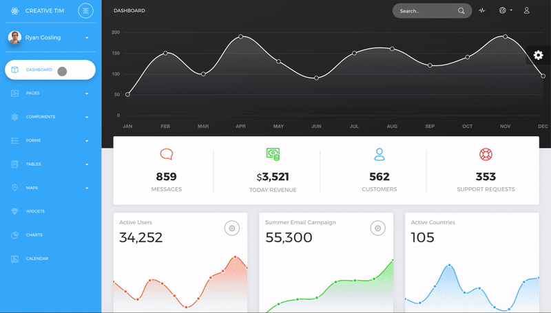

# [Material Dashboard PRO React](https://demos.creative-tim.com/now-ui-dashboard-pro-react/#/dashboard) [](https://twitter.com/intent/tweet?url=https%3A%2F%2Fnud-pro-react.creative-tim.com&text=Light%20Bootstrap%20Dashboard%20React%20-%20Free%20Bootstrap%20Admin%20Template&original_referer=https%3A%2F%2Fdemos.creative-tim.com%2Fnow-ui-dashboard-pro-react%2F&via=creativetim&hashtags=react%2Cbootstrap)


 [](https://github.com/creativetimofficial/ct-now-ui-dashboard-pro-react/issues?q=is%3Aopen+is%3Aissue) [](https://github.com/creativetimofficial/ct-now-ui-dashboard-pro/issues-react?q=is%3Aissue+is%3Aclosed)  [](https://discord.gg/E4aHAQy)



**[Now UI Dashboard PRO React](https://creativetimofficial.github.io/now-ui-dashboard-pro-react/#/dashboard)** is a premium admin dashboard template designed to be beautiful and simple. It is built on top of [Reactstrap](https://reactstrap.github.io/) and [React](https://reactjs.org/) ( [create-react-app](https://github.com/facebook/create-react-app) ), using [Now UI Dashboard PRO](https://www.creative-tim.com/product/now-ui-dashboard-pro) and it is fully responsive. It comes with a big collections of elements that will offer you multiple possibilities to create the app that best fits your needs. It can be used to create admin panels, project management systems, web applications backend, CMS or CRM.

The product represents a big suite of front-end developer tools that can help you jump start your project. We have created it thinking about things you actually need in a dashboard. Now UI Dashboard React contains multiple handpicked and optimized plugins. Everything is designed to fit with one another. As you will be able to see, the dashboard you can access on Creative Tim is a customization of this product.

It comes with 5 filter colors for the sidebar (`yellow`, `blue`,`green`,`orange`,`red`).

## Table of Contents

* [Versions](#versions)
* [Demo](#demo)
* [Quick Start](#quick-start)
* [Documentation](#documentation)
* [File Structure](#file-structure)
* [Browser Support](#browser-support)
* [Resources](#resources)
* [Reporting Issues](#reporting-issues)
* [Technical Support or Questions](#technical-support-or-questions)
* [Licensing](#licensing)
* [Useful Links](#useful-links)


## Versions

[](https://www.creative-tim.com/product/now-ui-dashboard-pro)
[](https://www.creative-tim.com/product/now-ui-dashboard-pro-react)
[](https://www.creative-tim.com/product/vue-now-ui-dashboard-pro)
[](https://www.creative-tim.com/product/now-ui-dashboard-pro-angular)


| HTML | React | Vue | Angular |
| --- | --- | --- | --- |
| [](https://www.creative-tim.com/product/now-ui-dashboard-pro) | [](https://www.creative-tim.com/product/now-ui-dashboard-pro-react)  | [](https://www.creative-tim.com/product/vue-now-ui-dashboard-pro)  | [](https://www.creative-tim.com/product/now-ui-dashboard-pro-angular)

## Demo

- [Start page](https://demos.creative-tim.com/now-ui-dashboard-pro-react/#/dashboard)
- [User profile page](https://demos.creative-tim.com/now-ui-dashboard-pro-react/#/user-page)
- [Tables page ](https://demos.creative-tim.com/now-ui-dashboard-pro-react/#/tables/extended-tables)
- [Maps Page](https://demos.creative-tim.com/now-ui-dashboard-pro-react/#/maps/google-maps)
- [Notifications page](https://demos.creative-tim.com/now-ui-dashboard-pro-react/#/components/notifications)

[View More](https://demos.creative-tim.com/now-ui-dashboard-pro-react/#/dashboard).


## Quick start

Quick start options:

- Buy from [Creative Tim](https://www.creative-tim.com/product/now-ui-dashboard-pro-react)


## Documentation
The documentation for the Material Dashboard Pro is hosted at our [website](https://demos.creative-tim.com/now-ui-dashboard-pro-react/#/documentation/tutorial).


## File Structure

Within the download you'll find the following directories and files:

```
now-ui-dashboad-pro-react
│
├── CHANGELOG.md
├── ISSUE_TEMPLATE.md
├── README.md
├── jsconfig.json
├── package.json
├── now-ui-dashboard-pro-react.gif
├── Documentation
│   └── tutorial-components.html
├── public
│   ├── index.html
│   └── manifest.json
└── src
    ├── index.js
    ├── logo-white.svg
    ├── logo.svg
    ├── routes.js
    ├── layouts
    │   ├── Admin.js
    │   └── Auth.js
    ├── variables
    │   ├── charts.js
    │   ├── general.js
    │   └── icons.js
    ├── assets
    │   ├── css
    │   │   ├── demo.css
    │   │   ├── now-ui-dashboard.css
    │   │   ├── now-ui-dashboard.css.map
    │   │   └── now-ui-dashboard.min.css
    │   ├── fonts
    │   ├── img
    │   │   ├── flags
    │   └── scss
    │       ├── now-ui-dashboard
    │       │   ├── cards
    │       │   ├── mixins
    │       │   ├── plugins
    │       │   └── react
    │       │       ├── custom
    │       │       ├── plugins
    │       │       └── react-differences.scss
    │       └── now-ui-dashboard.scss
    ├── components
    │   ├── CustomUpload
    │   │   ├── ImageUpload.js
    │   │   └── PictureUpload.js
    │   ├── FixedPlugin
    │   │   └── FixedPlugin.js
    │   ├── Footer
    │   │   └── Footer.js
    │   ├── Navbars
    │   │   ├── AdminNavbar.js
    │   │   └── AuthNavbar.js
    │   ├── PanelHeader
    │   │   └── PanelHeader.js
    │   └── Sidebar
    │       └── Sidebar.js
    └── views
        ├── Calendar
        │   └── Calendar.js
        ├── Charts
        │   └── Charts.js
        ├── Components
        │   ├── Buttons.js
        │   ├── GridSystem.js
        │   ├── Icons.js
        │   ├── Notifications.js
        │   ├── Panels.js
        │   ├── SweetAlertPage.js
        │   └── Typography.js
        ├── Dashboard
        │   └── Dashboard.js
        ├── Forms
        │   ├── ExtendedForms.js
        │   ├── RegularForms.js
        │   ├── ValidationForms.js
        │   └── Wizard
        │       ├── Step1.js
        │       ├── Step2.js
        │       ├── Step3.js
        │       └── Wizard.js
        ├── Maps
        │   ├── FullScreenMap.js
        │   ├── GoogleMaps.js
        │   └── VectorMap.js
        ├── Pages
        │   ├── LockScreenPage.js
        │   ├── LoginPage.js
        │   ├── PricingPage.js
        │   ├── RTL.js
        │   ├── RegisterPage.js
        │   ├── TimelinePage.js
        │   └── UserPage.js
        ├── Tables
        │   ├── ExtendedTables.js
        │   ├── ReactTable.js
        │   └── RegularTables.js
        └── Widgets
            └── Widgets.js
```

## Browser Support

At present, we officially aim to support the last two versions of the following browsers:

    


## Resources
- [Live Preview](https://demos.creative-tim.com/now-ui-dashboard-pro-react/#/dashboard)
- Buy Page: https://www.creative-tim.com/product/now-ui-dashboard-pro-react
- Documentation is [here](https://demos.creative-tim.com/now-ui-dashboard-pro-react/#/documentation/tutorial)
- License Agreement: https://www.creative-tim.com/license
- Support: https://www.creative-tim.com/contact-us
- Issues: [Github Issues Page](https://github.com/creativetimofficial/ct-now-ui-dashboard-pro-react/issues)
- Now UI Dashboard React - [demo](https://www.creative-tim.com/product/now-ui-dashboard-react?ref=github-md-pro-react)

## Reporting Issues
We use GitHub Issues as the official bug tracker for the Material Dashboard Pro. Here are some advices for our users that want to report an issue:

1. Make sure that you are using the latest version of the Material Dashboard Pro. Check the CHANGELOG from your dashboard on our [website](https://www.creative-tim.com/).
2. Providing us reproducible steps for the issue will shorten the time it takes for it to be fixed.
3. Some issues may be browser specific, so specifying in what browser you encountered the issue might help.

## Technical Support or Questions

If you have questions or need help integrating the product please [contact us](https://www.creative-tim.com/contact-us) instead of opening an issue.

## Licensing

- Copyright 2020 Creative Tim (https://www.creative-tim.com)
- Creative Tim [license](https://www.creative-tim.com/license)

## Useful Links

- [More products](https://www.creative-tim.com/bootstrap-themes) from Creative Tim

- [Tutorials](https://www.youtube.com/channel/UCVyTG4sCw-rOvB9oHkzZD1w)

- [Freebies](https://www.creative-tim.com/bootstrap-themes/free) from Creative Tim

- [Affiliate Program](https://www.creative-tim.com/affiliates/new) (earn money)

##### Social Media

Twitter: <https://twitter.com/CreativeTim>

Facebook: <https://www.facebook.com/CreativeTim>

Dribbble: <https://dribbble.com/creativetim>

Google+: <https://plus.google.com/+CreativetimPage>

Instagram: <https://instagram.com/creativetimofficial>
